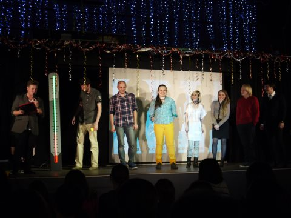
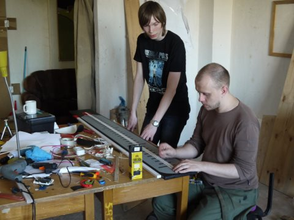
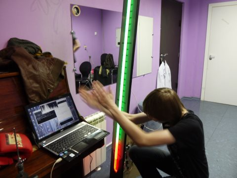

## SS-meter

**meter for mearuse 'Science Slam'ity**

*Science Slam* is the local event,
presenting scientific research to broad public
http://vk.com/scienceslamnsk

VIDEO http://www.youtube.com/watch?v=fryWdb5w5GM

[Arduino sketch](Arduino/serialSSmeter)
_Note: this scketch is usinig modified version of "Adafruit NeoPixel library", for more info see code_
  
[Processing sketch](Processing/volume2arduino)
_Note: basic volume metering using Minim library_

done by me, [*Mehanik*](https://github.com/Mehanik), [*PeterBeklemishev*](https://github.com/PeterBeklemishev)

